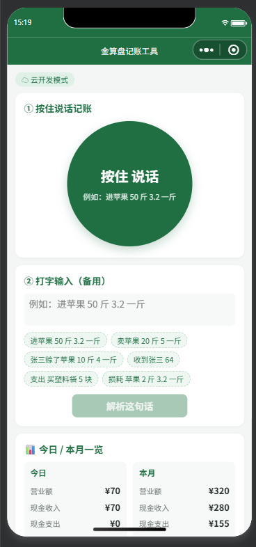
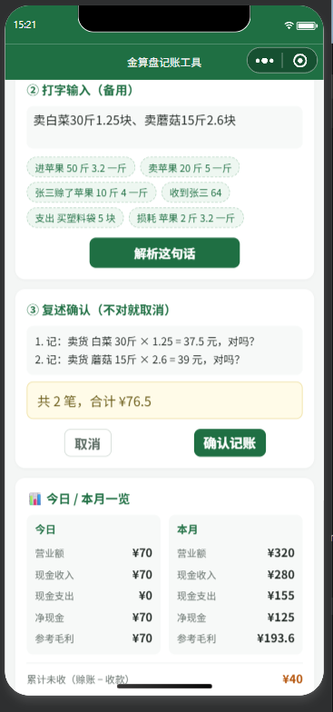
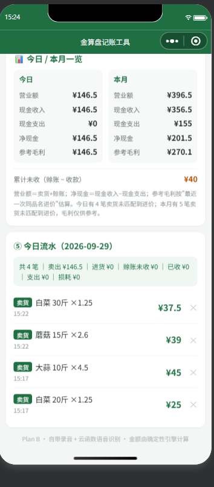
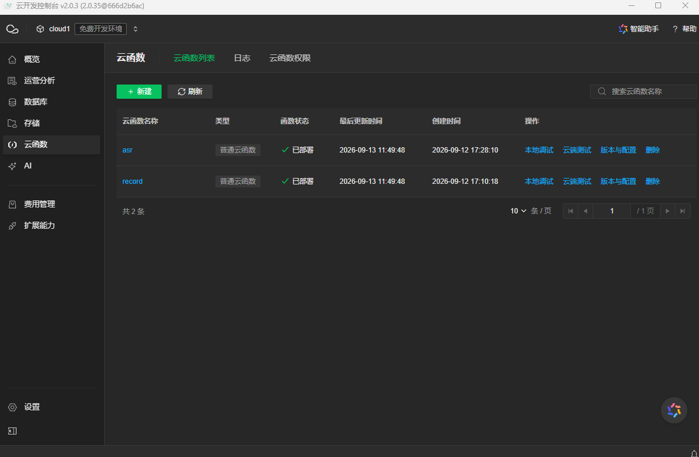
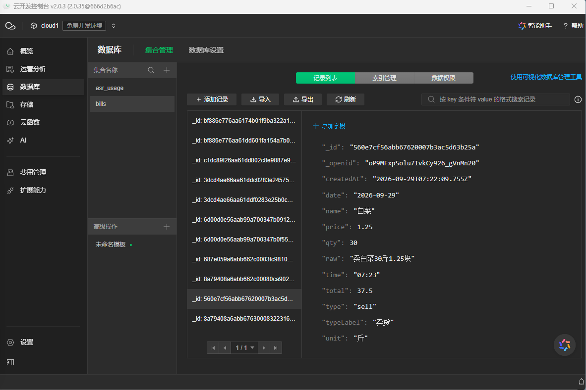
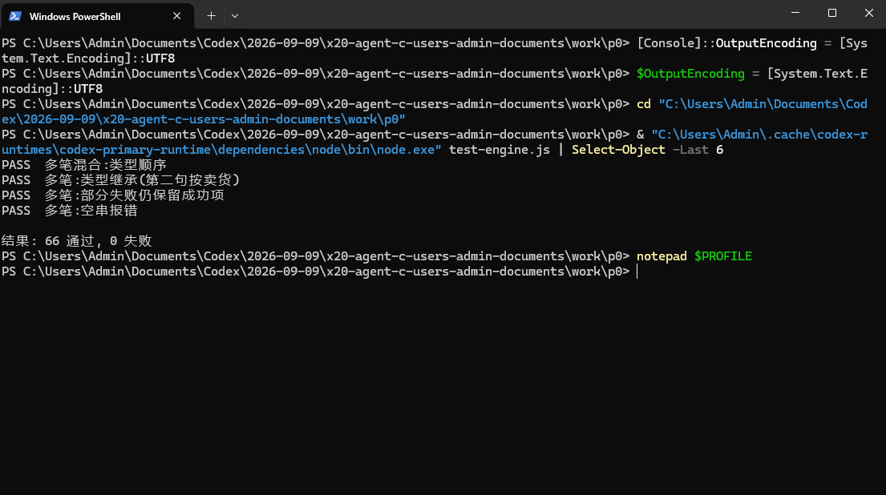

# 金算盘记账工具 · 商贩语音记账 Agent（P0 + P1 + P2）

> 小程序注册名：**金算盘记账工具**（因审核要求，由"金算盘"改为现名）—— 老板的"会说话的生意管家"。
> 项目一句话：老板**按住说一句**（或打字）→ 语音识别成文字 → 引擎解析 → **复述确认** → 落账 → 看今日流水。

> **语音方案说明（Plan B）**：同声传译插件对服务类目/主体有要求，本项目已放弃插件路线，改为
> **小程序自带录音（wx.getRecorderManager）+ 云函数 asr（腾讯云一句话识别）**。
> 好处：无插件、无类目限制，以后换方言模型/加品名热词都方便；密钥只在服务端，客户端拿不到。
> 语音播报（TTS）暂未做，复述确认先保留文字版（后续可接腾讯云 TTS 补齐）。

## 项目亮点

- **语音优先入口**：按住说话 → 腾讯云 ASR → 结构化记账，不用打字
- **金额永远由确定性引擎计算**：客户端预览 + 服务端 `validateForSave` 二次校验，语音识别只负责"填字段"
- **识别双通道容错**：云存储临时 URL 优先，失败自动回落 base64；环境变量白名单校验（填错自动回退默认值）
- **成本与防滥用**：每人每天限次（默认 50 次，可配置）；录音识别完成后立即删除
- **数据归属与隔离**：按 openid 隔离、写操作可撤销、密钥只存在服务端

## 技术栈

微信小程序原生 ｜ 微信云开发（云函数 / 云数据库 / 云存储）｜ 腾讯云一句话识别（ASR）｜ Node.js ｜ 自研确定性记账引擎 ｜ 66 个单元测试

## 项目状态

- 试点中：3 户真机试用（按住说话 → 复述确认 → 落库 → 今日日结）
- 引擎 66 个用例全过；语音链路 v7（含双通道容错、环境变量白名单、每日限次）
- 下一步：连续录音模式、日结/月结增强、扩到 10 户试点

## 界面预览

| 首页（按住说话 + 今日日结） | 一句话多笔 | 今日 / 本月汇总 |
|---|---|---|
|  |  |  |

| 云开发部署 | 云开发控制台 | 单元测试 66 通过 |
|---|---|---|
|  |  |  |


## 现在能做什么

| 能力 | 说明 |
|---|---|
| 🎙 按住说话 | 按住大按钮说话，松手后上传录音 → 云端识别 → 自动解析 |
| 🗣 一口气记多笔 | 一句话用「、」「，」分隔多笔，自动拆成清单，一次确认批量落库（例：卖白菜20斤3块、卖苹果10斤5块） |
| ⌨️ 打字记账 | 语音没配好也能用；点示例或自己输入 |
| 支持类型 | 进货 / 卖货 / 赊账 / 收款 / 支出 / 损耗 |
| 引擎算钱 | 数量 × 单价由**确定性引擎**计算（支持 3块2、3.2 一斤、一共160 等说法） |
| 复述确认 | 「记：进货 苹果 50斤 × 3.2 = 160 元，对吗？」，确认才落账 |
| 可撤销 | 今日流水每条都能删除（云端只允许删自己的） |
| 今日汇总 | 卖出 / 进货 / 赊账未收 / 已收 / 支出 / 损耗 一行看清 |
| 📊 今日/本月日结 | 营业额、现金收入/支出、净现金、累计未收（赊账−收款）一眼看清 |
| 📈 参考毛利 | 卖出收入 − 按"该笔卖出前、同品名最近一次进价"估算的成本 − 损耗；缺进价时明确提示"仅供参考" |
| 🛡 语音限次 | 每人每天默认 50 次（环境变量 ASR_DAILY_LIMIT 可调），防刷量 |
| 双模式 | 没连上云开发也能用「本地演示模式」（此时语音不可用，打字可用） |

**暂不做**：语音播报（TTS）、真实毛利/库存联动、支付流水对账、OCR、离线队列（留给 P2/P3）。

## 怎么跑起来

### 方式 A：本地演示（最快，验证打字闭环）
1. 微信开发者工具 → 导入项目 → 选本目录 `vendor-miniapp`。
2. 顶部显示「🧪 本地演示模式」，打字记账全流程可用；**语音需要云开发，此时不可用**。

### 方式 B：云开发 + 语音（推荐）
1. `project.config.json` 的 `appid` 为你的小程序 AppID（当前 `wxef47f205be6eb37f`）。
2. `miniprogram/config.js` 的 `cloudEnv` 填云开发**环境 ID**（当前 `cloud1-d9g5r04vt326e0025`）。
3. 部署两个云函数：右键 `cloudfunctions/record` 和 `cloudfunctions/asr` → **上传并部署：云端安装依赖**。
4. 重新编译，顶部显示「☁ 云开发模式」。

## P1 语音（Plan B）开通步骤

### 第 1 步：拿腾讯云语音识别密钥
1. 注册/登录腾讯云 → 开通「**语音识别 ASR**」服务（有免费额度，具体以控制台为准）。
2. 控制台 → 访问管理 → **API 密钥管理** → 新建密钥，得到 `SecretId` 和 `SecretKey`。
   > 建议用子账号密钥、只授权 ASR 权限；主账号密钥权限太大。

### 第 2 步：部署 asr 云函数
开发者工具 → 展开 `cloudfunctions` → 右键 `asr` → **上传并部署：云端安装依赖**（会把 `tencentcloud-sdk-nodejs` 一起装上）。

### 第 3 步：把密钥配到云函数（二选一，推荐第一种）
- **推荐：环境变量**（密钥不进代码库）
  云开发控制台 → 云函数 → `asr` → 配置 → 环境变量，添加：
  | 变量名 | 值 |
  |---|---|
  | `ASR_SECRET_ID` | 你的 SecretId |
  | `ASR_SECRET_KEY` | 你的 SecretKey |
  | `ASR_ENGINE` | 可选：`16k_zh`（普通话，默认）；`16k_zh_dialect`（带口音/方言） |
  | `ASR_REGION` | 可选：默认 `ap-guangzhou` |
- 备选：把 `cloudfunctions/asr/config.example.js` 复制为 `config.js` 并填密钥（方便但密钥会进代码目录，注意别上传到公开仓库）。

### 第 4 步：真机声明麦克风（发布/真机必需）
小程序后台 → 设置 → 服务内容声明 → **用户隐私保护指引** → 添加「**麦克风**」用途：用于语音记账，把您说的话转成账目。

### 语音怎么用
按住圆按钮 → 说话 → **松手** → 按钮显示"识别中…" → 弹出复述句 → 点「确认记账」→ 提示"已记好 ✓"。

### 语音排错表

| 现象 | 原因 / 处理 |
|---|---|
| 显示"语音暂不可用" | 没连云开发（顶部是🧪）→ 点「连接云开发」；或 `cloudEnv` 没填对 |
| 报"云函数不存在" | `asr` 没部署 → 右键 `cloudfunctions/asr` 上传并部署 |
| 报"未配置语音识别密钥" | 第 3 步环境变量没配好（或改完没重新部署/生效） |
| 真机提示隐私相关错误 | 后台《用户隐私保护指引》没声明麦克风 |
| 拉不起录音 / 没权限 | 手机设置里给该小程序开麦克风；iOS 需系统弹窗允许 |
| 报 
| 报 need param Url | 旧版 asr 的参数问题，现已改为 URL 优先 + base64 兜底；重新上传部署 asr 即可 |
| 报"录音太长了" | 单次 ≤ 60 秒、≤3MB；说短句 |
| 识别不准 | 靠手机近一点、说慢一点；把 `ASR_ENGINE` 改成 `16k_zh_dialect` 试试 |
| 报"今天的语音识别次数已用完" | 触发了每人每天限次（默认 50 次/天）；改环境变量 `ASR_DAILY_LIMIT` 可调整 |
| 腾讯云报鉴权/未开通 | 确认已开通 ASR 服务、密钥正确、账号不欠费 |

## P2 日结/月结口径说明（重要）

日结/月结的所有数字都由 `engine.js` 计算（服务端 `record` 云函数的 summary 动作用同一套代码），口径如下：

| 指标 | 口径 | 确定性 |
|---|---|---|
| 营业额 | 卖货 + 赊账（今天/本月生意做了多少） | ✅ 确定 |
| 现金收入 | 卖货收款 + 收回欠款（收款） | ✅ 确定 |
| 现金支出 | 进货 + 其他支出 | ✅ 确定 |
| 净现金 | 现金收入 − 现金支出 | ✅ 确定 |
| 累计未收 | 全部赊账 − 全部收款（跨月累计，不是当日） | ✅ 确定 |
| **参考毛利** | 卖出收入（卖货+赊账） − 按"该笔卖出之前、同品名最近一次进价"估算的成本 − 损耗 | ⚠️ 估算 |

> **为什么毛利是"参考"**：进货是库存、不是成本，严格算毛利需要库存台账（移动加权平均）。当前用"最近进价"做近似，进价波动大时会有偏差；若某笔卖出找不到对应进价，页面会提示"N 笔未匹配到进价，仅供参考"。
> 后续可升级为**精确毛利**（库存台账 + 移动加权平均 + 盘点），等你确认要不要投入这块工作量。


## 记账语法速查

| 想记 | 这样说 | 结果 |
|---|---|---|
| 进货 | 进苹果 50 斤 3.2 一斤 | 苹果 50斤 × 3.2 = ¥160 |
| 卖货 | 卖苹果 20 斤 5 一斤 | 苹果 20斤 × 5 = ¥100 |
| 赊账 | 张三赊了苹果 10 斤 4 一斤 | 赊账 张三，¥40（未收款） |
| 收款 | 收到张三 64 | 收款 张三 ¥64 |
| 支出 | 支出 买塑料袋 5 块 | 支出（买塑料袋）¥5 |
| 损耗 | 损耗 苹果 2 斤 3.2 一斤 | 损耗 ¥6.4 |
| 一口气多笔 | 卖白菜20斤3块、卖苹果10斤5块 | 拆成 2 笔，合计 ¥110，一次确认 |

> 数量/金额请用**阿拉伯数字**；记不清单价就说「一共 XXX」。说错了引擎会提示，不会乱记。

## 目录结构

```
vendor-miniapp/
├── project.config.json
├── README.md
├── miniprogram/
│   ├── app.js / app.json / app.wxss        # app.json 不再需要任何插件声明
│   ├── config.js                           # ★ cloudEnv
│   ├── utils/
│   │   ├── engine.js                       # 确定性记账引擎（解析+算钱）
│   │   ├── store.js                        # 数据层：云开发 / 本地演示
│   │   └── voice.js                        # Plan B 语音层：自带录音 + 上传 + 调 asr
│   └── pages/index/                        # 首页：按住说话/打字 → 复述 → 确认 → 今日流水
└── cloudfunctions/
    ├── record/                             # 落库 save / 查今日 today / 删除 remove（服务端重算金额）
    └── asr/                                # 录音 → 腾讯云一句话识别（URL 优先、base64 兜底；密钥只在服务端）
        ├── index.js
        ├── package.json
        └── config.example.js
```

## 设计要点（与《说明文档》架构的对应）

- **语音优先入口**：自带录音能力，无插件依赖、不受类目限制。
- **识别只"听懂"，钱由引擎算**：识别出的文字交给 `engine.js` 解析，金额 = 数量 × 单价，云端 `validateForSave` 再算一遍。
- **复述确认 + 可撤销**：写操作先复述，确认才落库，落了也能删。
- **密钥在服务端**：ASR 密钥只配在云函数，客户端代码里没有任何密钥。
- **识别取件更稳**：优先把云存储临时 URL 交给腾讯云拉取音频（不受 base64 大小限制），失败自动回落 base64 直传。
- **降级不崩**：没连云开发时语音不可用，但打字记账完整可用。
- **隐私**：录音用完即删（云函数识别后删除云存储文件）；数据按 openid 隔离。

## 自测

- 引擎单测：`node work/p0/test-engine.js` → **66 用例全过**（含日结/月结、应收、参考毛利、一句话多笔）。
- 云函数 `record`：save/today/remove + **summary**（营业额150/净现金−35/应收20/参考毛利47.6 的桩测试通过）；服务端重算金额、openid 隔离、越权删除被拒。
- 云函数 `asr`：URL 优先（0=URL、1=数据）、回落 base64、环境变量白名单回退、**每人每天限次**、识别后删除录音（桩测试通过）。
- 语音层：无 wx 环境安全降级、识别文本→解析链路正确（Node 测试通过）。
- 手工测试：需在开发者工具 + 真机（真机才能录音）。

## 进行中：忙时三件套（P2 第二批）

- ✅ **一句话多笔**（已完成）：`engine.parseMany` + 首页多笔清单确认 + 批量落库，66 个引擎用例全过；
- ⏳ **连续录音模式**（下一步）：点一次开始，边卖边说多笔，结束时一次性识别；
- ⏳ **松开即自动确认（3 秒可撤销）**：去掉"点确认"，减少一步操作；
- 🅿️ 待验证后决定：企业微信「微信客服」或服务号（¥300/年认证）承接"老板忙时发语音 → 后台记账"；先用 3 户人工假门测试验证，再决定是否付费开通；
- 其余：精确毛利（库存台账）、10 户试点物料（已交付）。
